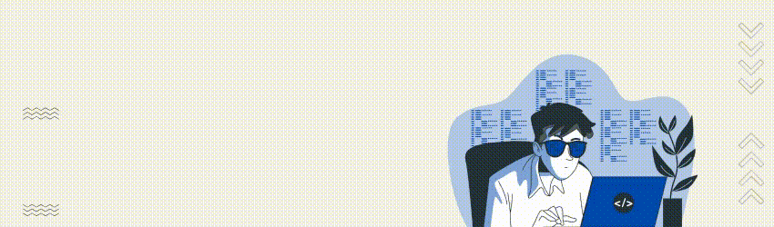

<table border="0" width="100%" cellpadding="0" cellspacing="0">
  <tr>
    <td width="60%" valign="top">
      <h1><strong>🙋‍♂️ About Me</strong></h1>
      

        <b>CS Graduate & Flutter Developer</b> focused on building clean, scalable front-ends with a strong UI/UX foundation. I prioritize software engineering principles over specific stacks, allowing me to adapt quickly and solve complex problems with efficient code.
      

      

        
        
        
      

    </td>
    <td width="40%" align="right" valign="top">
      
    </td>
  </tr>
</table>

<table border="0" width="100%" cellpadding="0" cellspacing="0">
  <tr>
    <td width="40%" align="left" valign="center">
      
    </td>
    <td width="60%" valign="top">
      <h1><strong>🛠️ Tech Stack & Tools</strong></h1>
      
      

 
    </td>
  </tr>
</table>

<table border="0" width="100%" cellpadding="0" cellspacing="0">
  <tr>
    <h1><strong>🚀 Top Projects</strong></h1>
    <td width="50%" align="center">
      
    </td>
    <td width="50%" align="center">
      
    </td>
  </tr>
  <tr>
    <td width="50%" align="center">
      
    </td>
    <td width="50%" align="center">
      
    </td>
  </tr>
</table>

<table border="0" width="100%" cellpadding="0" cellspacing="0">
  <tr>
  <h1><strong>🌟 Github Insights</strong></h1>
    <td width="70%" valign="top">
      
    </td>
    <td width="45%" align="center" valign="top">
      
    </td>
  </tr>
</table>

<picture>
    <source media="(prefers-color-scheme: dark)" srcset="https://raw.githubusercontent.com/MohamedAboSeada/MohamedAboSeada/output/pacman-contribution-graph-dark.svg">
    <source media="(prefers-color-scheme: light)" srcset="https://raw.githubusercontent.com/MohamedAboSeada/MohamedAboSeada/output/pacman-contribution-graph.svg">
    
</picture>
