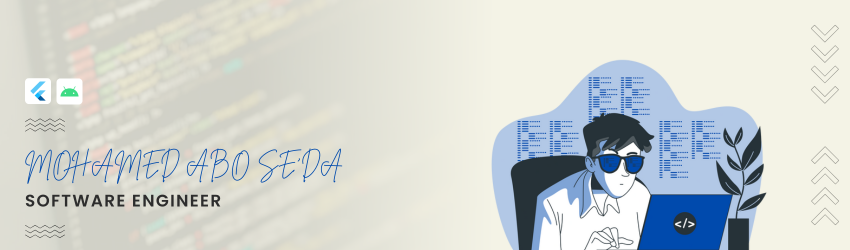

<table border="0">
  <tr>
    <td>
      <h1><strong>🙋‍♂️ About Me</strong></h1>
      

        <b>CS Graduate & Flutter Developer</b> focused on building clean, scalable front-ends with a strong UI/UX foundation. I prioritize software engineering principles over specific stacks, allowing me to adapt quickly and solve complex problems with efficient code.
      

    </td>
    <td width="200px">
      
    </td>
  </tr>
</table>

---

<table border="0">
  <tr>
    <td width="200px">
      
    </td>
    <td>
      <h1><strong>🏗️ Tech Stack</strong></h1>
      
    </td>
  </tr>
</table>

---

<h1><strong>🌟 Github Insights</strong></h1>

